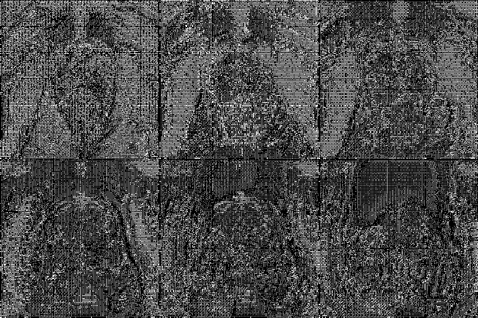

# Prostate158
> A collection of prostate MR studies with expert annotations

## What is Prostate158
Prostate158 is a curated dataset of biparametric 3 Tesla prostate MRI images for automatic segmentation of anatomical zones and cancerous lesions. Histopathologic confirmation is available for each cancerous lesion. All studies include a T2-weighted (T2W) and diffusion-weighted (DWI) images with apparent diffusion coefficient (ADC) maps. Images in each study were resampled so that orientation, direction, and spacing were the same.


## Accessing the Prostate158 Data Set

The training dataset (139 MRIs) is freely available at [](https://doi.org/10.5281/zenodo.6481141).

The test dataset consists of 19 additional MRIs and can be found at [](https://doi.org/10.5281/zenodo.6592345)


## Baseline
We have trained U-Net base models for segmentation of the anatomical zones as well as the cancer areas in the prostate images, which can serve as a basis for comparison with future approaches. The weights for the models are available at: [](https://doi.org/10.5281/zenodo.6397057)  
Since two raters segmented the anatomical zones and the cancer areas in the test dataset, the model score is given in comparison to each rater.

<table border=1 frame=void rules=rows>
    <thead>
        <tr>
            <td></td>
            <td colspan = 3><b><center>Rater 1</center></b></td>
            <td>&emsp;</td>
            <td colspan = 3><b><center>Rater 2</center></b></td>
        </tr>
        <tr>
            <th>Metric</th>
            <th>Transitional Zone</th>
            <th>Peripheral Zone</th>
            <th>Cancer</th>
            <th>&emsp;</th>
            <th>Transitional Zone</th>
            <th>Peripheral Zone</th>
            <th>Cancer</th>
        </tr>
    </thead>
    <tbody>
        <tr>
            <td><a href='https://en.wikipedia.org/wiki/S%C3%B8rensen%E2%80%93Dice_coefficient'>Dice Coefficient </a></td>
            <td> 0.877</td>
            <td> 0.754</td>
            <td> 0.453</td>
            <td>&emsp;</td>
            <td> 0.875</td>
            <td> 0.730</td>
            <td> 0.398</td>
        </tr>
        <tr>
            <td><a href='https://en.wikipedia.org/wiki/Hausdorff_distance'>Hausdorff Distance </a></td>
            <td> 18.3</td>
            <td> 22.8</td>
            <td> 36.7</td>
            <td>&emsp;</td>
            <td> 17.5</td>
            <td> 33.2</td>
            <td> 39.5</td>        
        </tr>
        <tr>
            <td><a href='https://github.com/deepmind/surface-distance'>Surface Distance </a></td>
            <td> 2.19</td>
            <td> 1.95</td>
            <td> 17.37</td>
            <td>&emsp;</td>
            <td> 2.59</td>
            <td> 1.88</td>
            <td> 19.13</td>
        </tr>
    </tbody>
</table>

## How to reproduce the baseline

### Dependencies
The baseline has been trained with the following packages and versions:

```
MONAI version: 0.9.dev2149
PyTorch version: 1.9.1
PyTorch Ignite version: 0.4.7
Numpy version: 1.21.2
pandas version: 1.3.5
PyYAML version: 5.4.1
Munch version: 2.5.0
```
You should be able to install all dependencies with: `pip install -U "monai[all]" pyyaml munch pandas`

Additionally you should install OpenCV: `sudo apt update` and `sudo apt install libopencv-dev python3-opencv`

### Train an Anatomy Segmentation Model
Adapt the `data_dir`, the `train_csv`, `valid_csv` and `test_csv` file paths in the `anatomy.yaml`.
Then execute:  
```bash
python train.py --config anatomy.yaml

```
This will launch a training session which should give similar results as in the paper. However, even with a random seed, results between runs my vary up to 1%.

Inside a jupyter notebook, training can be started with the following code:

```python
import monai
from prostate.utils import load_config
from prostate.train import SegmentationTrainer

config = load_config('anatomy.yaml')
monai.utils.set_determinism(seed=config.seed)

trainer=SegmentationTrainer(
    config=config,
    progress_bar=True,
    early_stopping = True,
    metrics = ["MeanDice", "HausdorffDistance", "SurfaceDistance"],
    save_latest_metrics = True,
)

trainer.run()
```
If satisfied, evaluate the model on a new dataset.
```python
from prostate.data import segmentation_dataloaders
test_dl = segmentation_dataloaders(config=config, train=False, valid=False, test=True)
trainer.evaluate(
    checkpoint='models/NAME_OF_CHECKPOINT.pt',
    dataloader=test_dl
)
```

See also the [train.ipynb](train.ipynb) notebook for a more detailed tutorial.
